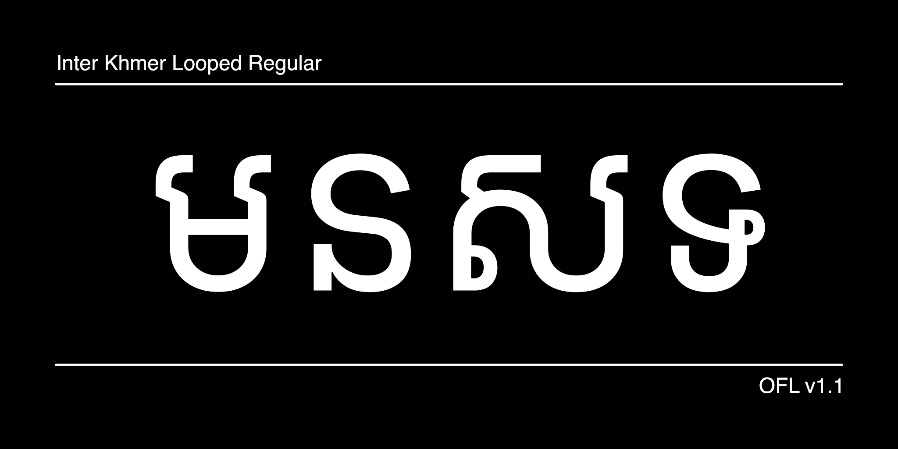

# Inter Font Extensions

<!-- TODO! setup gh-pages
[![][Fontbakery]](https://grab.github.io/inter-font-extensions/fontbakery/fontbakery-report.html)
[![][Universal]](https://grab.github.io/inter-font-extensions/fontbakery/fontbakery-report.html)
[![][GF Profile]](https://grab.github.io/inter-font-extensions/fontbakery/fontbakery-report.html)
[![][Shaping]](https://grab.github.io/inter-font-extensions/fontbakery/fontbakery-report.html)

[Fontbakery]: https://img.shields.io/endpoint?url=https%3A%2F%2Fraw.githubusercontent.com%2Fgrab%2Finter-font-extensions%2Fgh-pages%2Fbadges%2Foverall.json
[GF Profile]: https://img.shields.io/endpoint?url=https%3A%2F%2Fraw.githubusercontent.com%2Fgrab%2Finter-font-extensions%2Fgh-pages%2Fbadges%2Fgrab.json
[Outline Correctness]: https://img.shields.io/endpoint?url=https%3A%2F%2Fraw.githubusercontent.com%2Fgrab%2Finter-font-extensions%2Fgh-pages%2Fbadges%2FOutlineCorrectnessChecks.json
[Shaping]: https://img.shields.io/endpoint?url=https%3A%2F%2Fraw.githubusercontent.com%2Fgrab%2Finter-font-extensions%2Fgh-pages%2Fbadges%2FShapingChecks.json
[Universal]: https://img.shields.io/endpoint?url=https%3A%2F%2Fraw.githubusercontent.com%2Fgrab%2Finter-font-extensions%2Fgh-pages%2Fbadges%2FUniversal.json
-->

A Southeast Asian script extension of the Inter font family, adding support for Khmer, Thai, and Myanmar scripts. This project expands the versatility of Inter to serve the diverse typographic needs of Southeast Asian users.

## Overview

This font extension project, commissioned by Grab, aims to bring the contemporary and highly legible design principles of Inter to major Southeast Asian writing systems. The extension maintains Inter's clean aesthetic while ensuring authentic representation of each script's cultural and typographic traditions.

## Features

* Seamless integration with the original Inter font family
* Complete support for three major Southeast Asian scripts:
  * Khmer
  * Thai
  * Myanmar

## About the Project

This project was commissioned by Grab to enhance digital typography accessibility across Southeast Asia. By extending Inter's support to these writing systems, we aim to provide consistent, high-quality typography for users across the region.

## Building

Fonts are built automatically by GitHub Actions - take a look in the "Actions" tab for the latest build.

If you want to build fonts manually on your own computer:

* `make build` will produce all font files.
* `make build-only-var` will produce only variable font files.
* `make test` will run [FontBakery](https://github.com/googlefonts/fontbakery)'s quality assurance tests.
* `make proof` will generate HTML proof files.

For more information about font building and project structure, please visit [BUILDING.md](./BUILDING.md).

<!-- The proof files and QA tests are also available automatically via GitHub Actions - look at `https://grab.github.io/inter-font-extensions`. -->

## License

This Font Software is licensed under the SIL Open Font License, Version 1.1.
This license is available with a FAQ at https://scripts.sil.org/OFL

## Repository Layout

This font repository structure is inspired by [Unified Font Repository v0.3](https://github.com/unified-font-repository/Unified-Font-Repository), modified for the Google Fonts workflow.

## Contributing

We welcome contributions from the community. Please use GitHub's Issues page to report any issues or ask any questions.

## Acknowledgments

* Original [Inter](https://github.com/rsms/inter) font family by [Rasmus Andersson](https://github.com/rsms)
* [Grab](https://grab.com) for commissioning and supporting this project
* All contributors and reviewers involved in the development